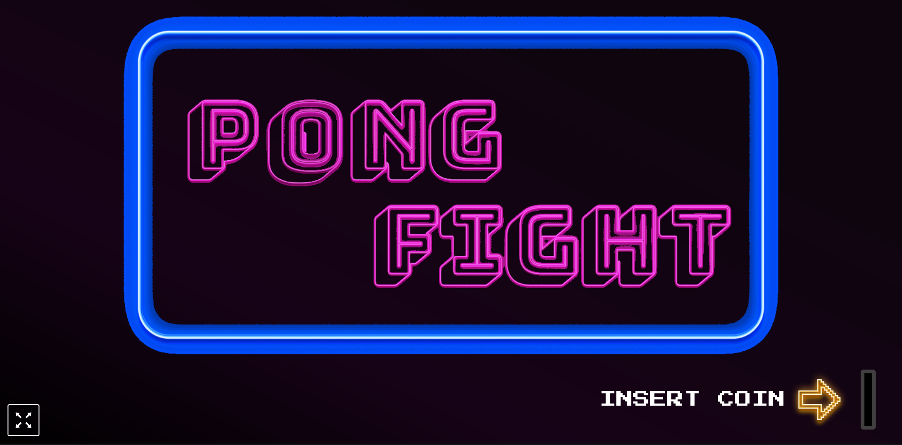
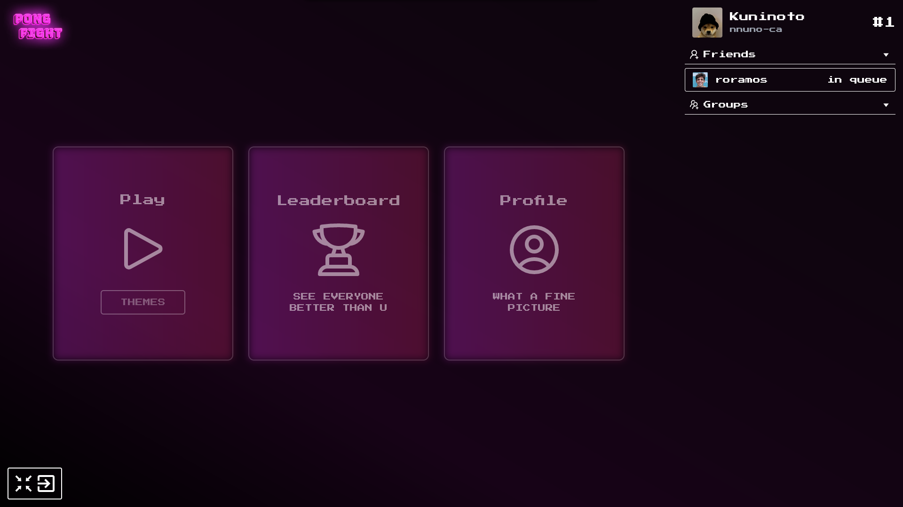
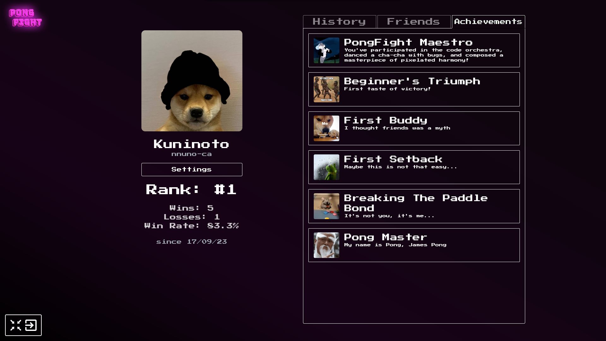

  <h1>
    Transcendence
  </h1>
	
> No more C! No more C++!
>This project is about doing something you’ve never done before.
>Remind yourself the beginning of your journey in computer science.
>Look at you now. Time to shine!

---

  <h2>
    Description
  </h2>

A website to host the might pong contest!

> Disclaimer: Only tested on Google Chrome and Brave (Also works on Firefox but has a **visual** bug on user's profile avatar update field)

<h4>
    Project done in collaboration with:  
</h4>

[Rodrigo Ramos](https://github.com/ramos21rodrigo) 
[Nuno Carvalho](https://github.com/Kuninoto)  

<h4>
    Features:
</h4>

- User accounts/profiles and relations (friendships & blocks)
- OAuth2 Login with 42's intranet and 2FA with Google Authenticator
- Chat (groups with roles (owner, admin and participant) and DMs)
- Pong game (with themes!)
- Matchmaking, 1v1 and match history

###  Subject (v12.1): [ft_transcendence en_subject](./extras/en.subject_ft_transcendence.pdf)

---

  <h2>
    Technologies
  </h2>
    &nbsp;
    &nbsp;
    &nbsp;  
    &nbsp;
    &nbsp;
      

---

  <h2>
    How to run
  </h2>

- Install Docker: [install Docker engine official docs](https://docs.docker.com/engine/install/)  
- Clone this repository

        git clone https://github.com/RealMadnessWorld/Transcendence
- Navigate to lvl_6_ft_transcendence

        cd Transcendence/lvl_6_ft_transcendence
- Write a .env file on /backend and /frontend like the .env.example to use your very own configurations  
- Navigate back to lvl_6_ft_transcendence and run the containers

        cd lvl_6_ft_transcendence && docker-compose up --build

---

	 

